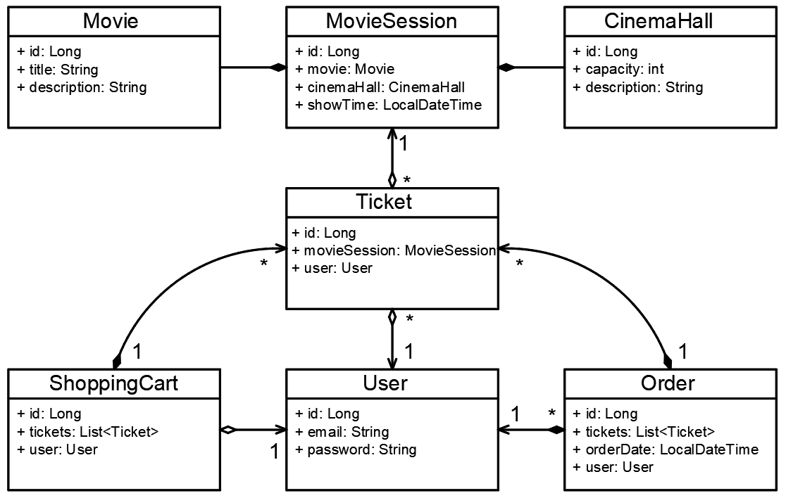

# my-cinema-app
## Project description:
A simple web application for scheduling movies, concerts, festivals and other shows and selling tickets. Potential customers of this application can be small and large cinemas, opera houses and other concert and theater venues.

The program is written in Java, so it will work stably on any Windows, Linux or Mac platform. The program is written according to SOLID principles.

This project has administrator and user roles. The role of the administrator is performed by the customer's employees, who plan their work and enter relevant information into the database. User role - for all registered users, that is, for all potential viewers. Here they can select the events they are interested in and purchase tickets.

Unique administrator rights:
- add movie theaters, movies, movie sessions;
- edit and delete movie-sessions by id;
- receive users by their email.

Unique user rights:
- add movies to shopping carts;
- get shopping carts;
- issue and receive orders.

## Features:
1. Implemented concepts of dependency injection (DI), inversion of control (IoC), MVC and DTO;
2. Configured DB authentication;
3. Realized role entity;
4. Configured role access to specific resources for `ADMIN` and for `USER`: 
- POST: /register - all
- GET: /cinema-halls - user/admin
- POST: /cinema-halls - admin
- GET: /movies - user/admin
- POST: /movies - admin
- GET: /movie-sessions/available - user/admin
- POST: /movie-sessions - admin
- PUT: /movie-sessions/{id} - admin
- DELETE: /movie-sessions/{id} - admin
- GET: /orders - user
- POST: /orders/complete - user
- PUT: /shopping-carts/movie-sessions - user
- GET: /shopping-carts/by-user - user
- GET: /users/by-email - admin

## Project structure:
- Config - program configuration;
- Controller - processing user requests and calling server services;
- DAO - data access layer;
- DTO - data transfer objects;
- Model - models of the application;
- service - application logic layer. 

## User technologies and libraries:
- Java 11;
- Spring (Core, Web, Security);
- Hibernate;
- Maven;
- MySQL;
- Apache Log4j-core;
- Checkstyle plugin.
- Git;
 
## Steps to run the program on your computer:
1. For the administrator:
- on the administrator's PC (on the server) must be installed: Java (not lower than version 11), maven, MySQL, Git, Tomcat version 9.0.50;
- create a project fork in your repository;
- clone the project locally;
- create a separate branch;
- create a scheme in the MySQL database and give it a name (for example, "cinema");
- configure the db.properties file (specify hibernate.hbm2ddl.auto=create, specify the name of the created schema in the database and other properties);
- in the "DataInitializer" class ("config" package) in the inject() method, specify the email address of the administrator and a secure password;
- configure and start Tomcat;
- after the first launch of the program, replace the hibernate.hbm2ddl.auto=create property with hibernate.hbm2ddl.auto=validate in the db.properties file and delete the inject() method in the "DataInitializer" class ("config" "package);
- after the second launch, the web application is ready to work, and now you can fill the database with data;
2. For the user:
- register in this application, while specifying the e-mail address and password (the password must contain at least 8 characters and must be duplicated);
- then you can choose the events you are interested in and buy tickets.

## Database UML diagram:
